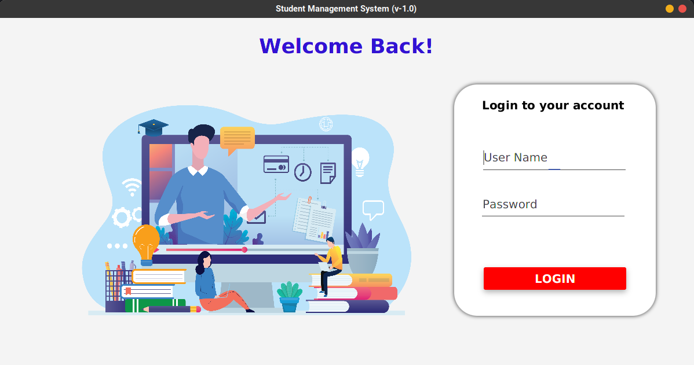
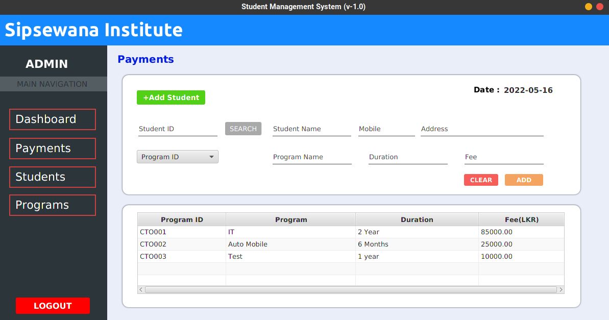

# Sipsewana Institute Student Management System

## Description
#### This system creates for manage registration process in Sipsenwana Institute.
#### The system can use for three job roles. There are front office reception, hotel manager and hotel restaurant cashier.

#### This system provide the following functionalities,
* To register students.
* To add new training programs.
* To view the details of the students who registered to the training programs at the Sipsewana
   institute.

## Sample Screenshots

## Tech/framework used
* Java
* JavaFx
* MySQL
* Hibernate
* Layered Architecture

**Developed By _Chamodh Pasindu_**